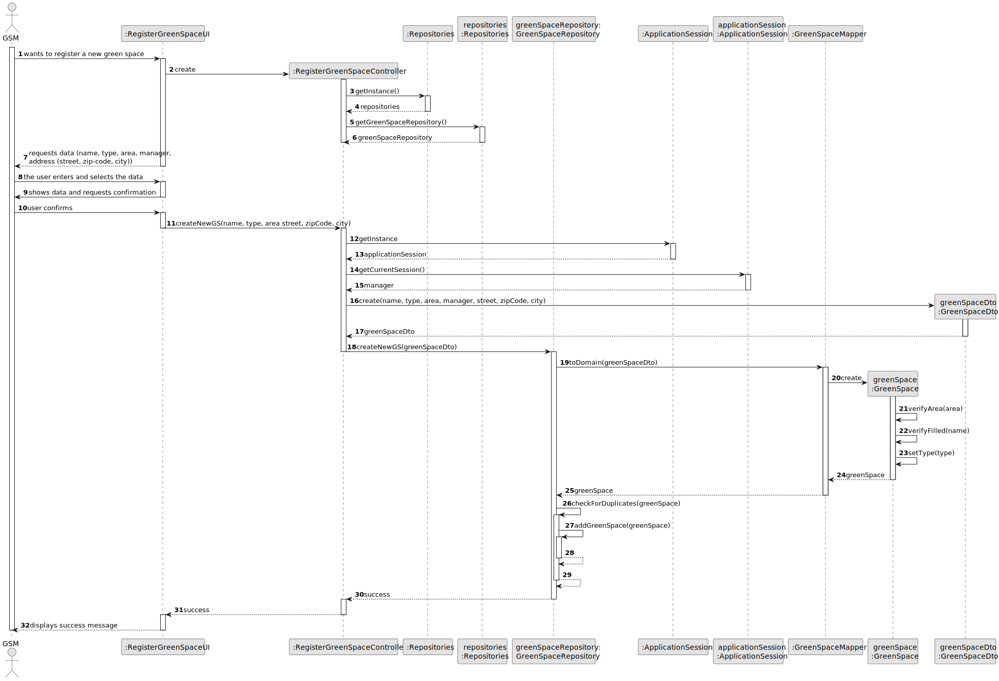
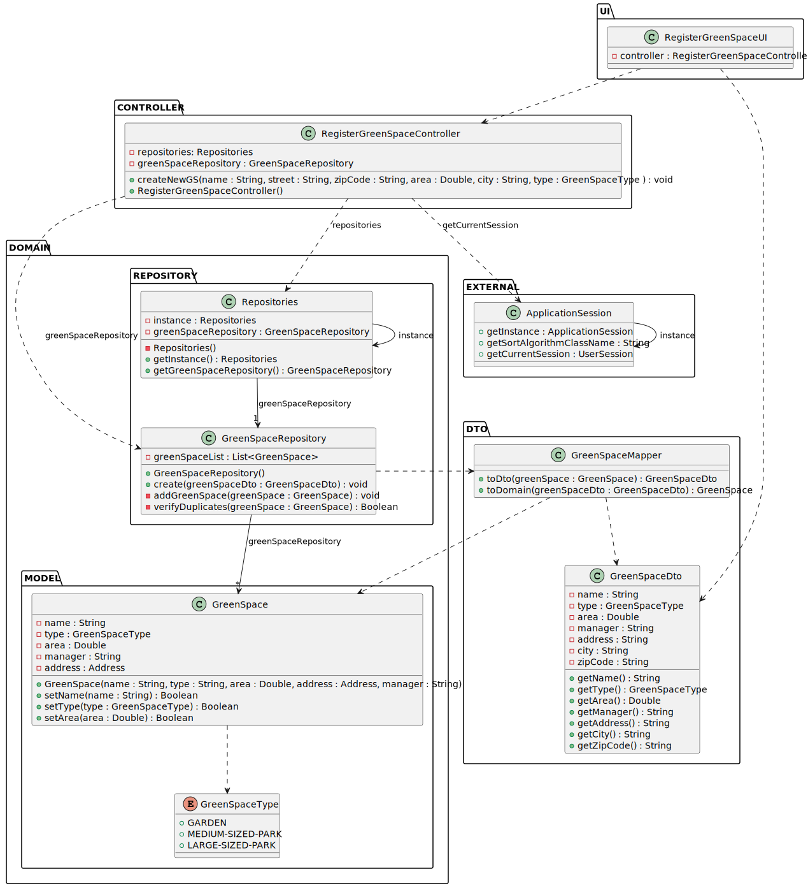

# US020 - Register a green space and its respective area

## 3. Design - User Story Realization 

### 3.1. Rationale

_**Note that SSD - Alternative One is adopted.**_

| Interaction ID | Question: Which class is responsible for...   | Answer                       | Justification (with patterns)                                                           |
|:---------------|:----------------------------------------------|:-----------------------------|:----------------------------------------------------------------------------------------|
| Step 1         | ... interacting with the actor?               | RegisterGreenSpaceUI         | Pure Fabrication: There is no need to assign this responsibility to any existing class. |
|                | ... coordinating the US?                      | RegisterGreenSpaceController | Controller.                                                                             |
| Step 2         | ... requesting data?                          | RegisterGreenSpaceUI         | Pure Fabrication.                                                                       |
| Step 3         | ... receiving data?                           | RegisterGreenSpaceUI         | Pure Fabrication.                                                                       |
| Step 4         | ... showing data and requesting confirmation? | RegisterGreenSpaceUI         | Pure Fabrication.                                                                       |
| Step 5         | ... get the Green Space repository?           | Repositories                 | Information Expert.                                                                     |
|                | ... having all the repositories?              | Repositories                 | Information Expert, High cohesion, Low coupling.                                        |
|                | ... instantiating a new green space?          | GreenSpaceRepository         | Creator, High cohesion, Low coupling.                                                   |
|                | ... validating all data (local validation)?   | GreenSpace                   | Information Expert.                                                                     | 
|                | ... validating all data (global validation)?  | GreenSpaceRepository         | Information Expert.                                                                     | 
|                | ... saving the green space created?           | GreenSpaceRepository         | Information Expert.                                                                     |
| Step 6         | ... informing operation success?              | RegisterGreenSpaceUI         | Pure Fabrication.                                                                       |

### Systematization ##

According to the taken rationale, the conceptual classes promoted to software classes are: 

* GreenSpace

Other software classes (i.e. Pure Fabrication) identified: 

* Repositories
* RegisterGreenSpaceController
* GreenSpaceRepository
* RegisterGreenSpaceUI

## 3.2. Sequence Diagram (SD)

_**Note that SSD - Alternative Two is adopted.**_

### Full Diagram

This diagram shows the full sequence of interactions between the classes involved in the realization of this user story.

### Split Diagrams

The following diagram shows the same sequence of interactions between the classes involved in the realization of this user story, but it is split in partial diagrams to better illustrate the interactions between the classes.

It uses Interaction Occurrence (a.k.a. Interaction Use).

**Get Green Space Repository Partial SD**

**Register a Green Space**

## 3.3. Class Diagram (CD)

