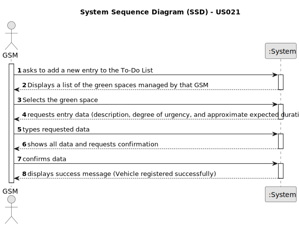

# US021 - Add a new entry to the To-Do List

## 1. Requirements Engineering

### 1.1. User Story Description

As a Green Space Maneger (GSM), I want to add a new entry to the To-Do List.

### 1.2. Customer Specifications and Clarifications 

**From the specifications document:**

>  These tasks can be regular (e.g. pruning trees) or occasional (e.g. repairing a broken equipment).  
>   They may also require a multi-disciplinary team and the length of the task can vary from a few minutes (e.g. replacing a light bulb) to weeks (e.g. installing an irrigation system).
 
**From the client clarifications:**

> **Question:**   
> 
> **Answer:** 

### 1.3. Acceptance Criteria

* **AC1:** The new entry must be associated with a green space managed by the GSM.
* **AC2:** The green space for the new entry should be chosen from a list presented to the GSM.

### 1.4. Found out Dependencies

* US020 - Register a Green Space and its area 

### 1.5 Input and Output Data

**Input Data:**

* Typed data:
    * Designation
    * Expected duration
	
* Selected data:
    * degree of urgency
    * Green Space 

**Output Data:**

* (In)Success of the operation

### 1.6. System Sequence Diagram (SSD)

**_Other alternatives might exist._**

#### Alternative One

### 1.7 Other Relevant Remarks

* None