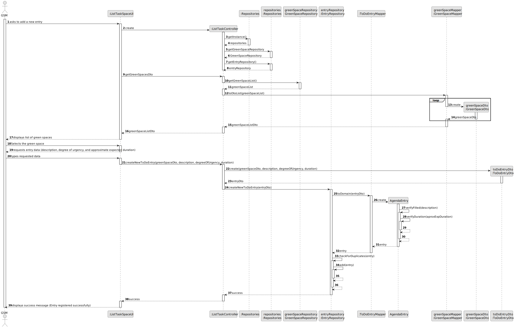

# US021 - Add a new toDoEntry to the To-Do List

## 3. Design - User Story Realization

### 3.1. Rationale

_**Note that SSD - Alternative One is adopted.**_

| Interaction ID | Question: Which class is responsible for...                  | Answer                      | Justification (with patterns)                                                                                                                                                             |
|:---------------|:-------------------------------------------------------------|:----------------------------|:------------------------------------------------------------------------------------------------------------------------------------------------------------------------------------------|
| Step 1         | ... interacting with the actor?                              | RegisterToDoEntryUI         | Pure Fabrication                                                                                                                                                                          |
|                | ... coordinating the US?                                     | RegisterToDoEntryController | Controller                                                                                                                                                                                |
| Step 2         | ... Displays a list of the green spaces managed by that GSM? | RegisterToDoEntryUI         | Pure Fabrication                                                                                                                                                                          |
| Step 3         | ... Selects the green space?                                 | RegisterToDoEntryUI         | Pure Fabrication                                                                                                                                                                          |
| Step 4         | ... requests entry data?                                     | RegisterToDoEntryUI         | Pure Fabrication                                                                                                                                                                          |
| Step 5         | ... types requested data?                                    | RegisterToDoEntryController | Controller: RegisterToDoEntryController manages the registration process, ensuring high cohesion and low coupling by encapsulating related functionality.                                 |
|                | ... get EntryRepository?                                     | Repositories                | Pure Fabrication:  Repositories is responsible for providing access to various repositories. It promotes low coupling and high cohesion by encapsulating data access logic.               |
|                | ... verify existing entry?                                   | EntryRepository             | Information Expert: EntryRepository performs global validation, adhering to the Protected Variation pattern by encapsulating data access.                                                 |
|                | ... register a entry?                                        | EntryRepository             | Creator: Entry is directly created by EntryRepository, which encapsulates the logic for managing entries.                                                                                 |
|                | ... validating all data (local validation)?                  | Entry                       | Information Expert: Entry performs local validation on its attributes, adhering to the Information Expert pattern by encapsulating its own data validation logic.                         | 
|                | ... validating all data (global validation)?                 | EntryRepository             | Information Expert: EntryRepository performs global validation, following the Protected Variation pattern by encapsulating validation rules.                                              | 
|                | ... stores entry registration data?                          | EntryRepository             | Repository Pattern: EntryRepository is responsible for persisting and managing entry registration data, applying the Low Coupling pattern by decoupling data storage from business logic. |
| Step 6         | ... showing all data and requests confirmation?              | RegisterToDoEntryUI         | Pure Fabrication: RegisterToDoEntryUI handles user interaction and displays success/error messages, promoting low coupling and high cohesion by encapsulating UI logic.                   | 
| Step 7         | ... confirming data?                                         | RegisterToDoEntryUI         | Pure Fabrication                                                                                                                                                                          |
| Step 8         | ... informing operation success?                             | RegisterToDoEntryUI         | Pure Fabrication: RegisterToDoEntryUI handles user interaction and displays success/error messages, promoting low coupling and high cohesion by encapsulating UI logic.                   |

### Systematization ##

According to the taken rationale, the conceptual classes promoted to software classes are:

* Entry

Other software classes (i.e. Pure Fabrication) identified:

* RegisterToDoEntryUI
* RegisterToDoEntryController
* Repositories
* EntryRepository

## 3.2. Sequence Diagram (SD)

_**Note that SSD - Alternative Two is adopted.**_

### Full Diagram

This diagram shows the full sequence of interactions between the classes involved in the realization of this user story.

## 3.3. Class Diagram (CD)

