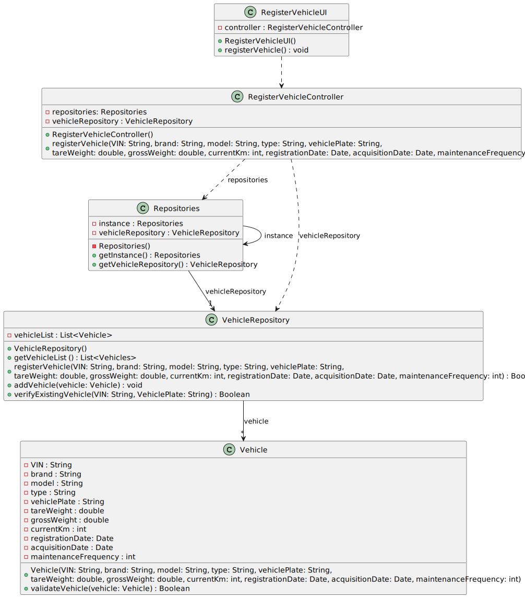

# US021 - Add a new toDoEntry to the To-Do List

## 3. Design - User Story Realization

### 3.1. Rationale

_**Note that SSD - Alternative One is adopted.**_

| Interaction ID | Question: Which class is responsible for...                  | Answer                      | Justification (with patterns)                                                                                                                                                                 |
|:---------------|:-------------------------------------------------------------|:----------------------------|:----------------------------------------------------------------------------------------------------------------------------------------------------------------------------------------------|
| Step 1         | ... interacting with the actor?                              | RegisterToDoEntryUI         | Pure Fabrication                                                                                                                                                                              |
|                | ... coordinating the US?                                     | RegisterToDoEntryController | Controller                                                                                                                                                                                    |
| Step 2         | ... Displays a list of the green spaces managed by that GSM? | RegisterToDoEntryUI         | Pure Fabrication                                                                                                                                                                              |
| Step 3         | ... Selects the green space?                                 | RegisterToDoEntryUI         | Pure Fabrication                                                                                                                                                                              |
| Step 4         | ... requests entry data?                                     | RegisterToDoEntryUI         | Pure Fabrication                                                                                                                                                                              |
| Step 5         | ... types requested data?                                    | RegisterVehicleController   | Controller: RegisterVehicleController manages the registration process, ensuring high cohesion and low coupling by encapsulating related functionality.                                       |
|                | ... get VehicleRepository?                                   | Repositories                | Pure Fabrication:  Repositories is responsible for providing access to various repositories. It promotes low coupling and high cohesion by encapsulating data access logic.                   |
|                | ... verify existing vehicle?                                 | VehicleRepository           | Information Expert: VehicleRepository performs global validation, adhering to the Protected Variation pattern by encapsulating data access.                                                   |
|                | ... register a vehicle?                                      | VehicleRepository           | Creator: Vehicle is directly created by vehicleRepository, which encapsulates the logic for managing vehicles.                                                                                |
|                | ... validating all data (local validation)?                  | Vehicle                     | Information Expert: Vehicle performs local validation on its attributes, adhering to the Information Expert pattern by encapsulating its own data validation logic.                           | 
|                | ... validating all data (global validation)?                 | VehicleRepository           | Information Expert: VehicleRepository performs global validation, following the Protected Variation pattern by encapsulating validation rules.                                                | 
|                | ... stores vehicle registration data?                        | VehicleRepository           | Repository Pattern: VehicleRepository is responsible for persisting and managing vehicle registration data, applying the Low Coupling pattern by decoupling data storage from business logic. |
| Step 6         | ... informing operation success?                             | RegisterVehicleUI           | Pure Fabrication: RegisterVehicleUI handles user interaction and displays success/error messages, promoting low coupling and high cohesion by encapsulating UI logic.                         | 

### Systematization ##

According to the taken rationale, the conceptual classes promoted to software classes are:

* Vehicle

Other software classes (i.e. Pure Fabrication) identified:

* Repositories
* RegisterToDoEntryUI
* EntryRepository
* RegisterToDoEntryController

## 3.2. Sequence Diagram (SD)

_**Note that SSD - Alternative Two is adopted.**_

### Full Diagram

This diagram shows the full sequence of interactions between the classes involved in the realization of this user story.

### Split Diagrams

The following diagram shows the same sequence of interactions between the classes involved in the realization of this
user story, but it is split in partial diagrams to better illustrate the interactions between the classes.

It uses Interaction Occurrence (a.k.a. Interaction Use).

**Get Vehicle Repository Partial SD**

**Verify Existing Vehicle Partial SD**

**Register a Vehicle**

## 3.3. Class Diagram (CD)

