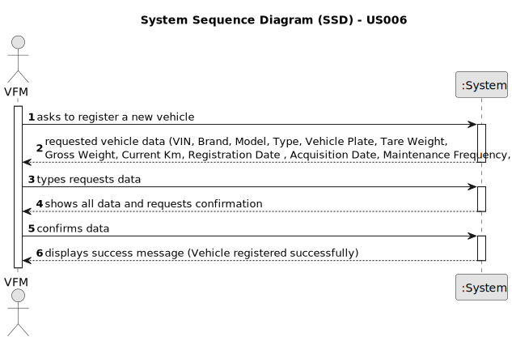

# US022 - Add a new entry in the Agenda

## 1. Requirements Engineering

### 1.1. User Story Description

As a Green Space Manager (GSM), I want to add a new entry in the Agenda to manage tasks related to green spaces effectively.

### 1.2. Customer Specifications and Clarifications 

**From the specifications document:**

>  The person who adds the entries in the Agenda is the GSM, and the entry is saved in the system. 
>  The new entry must have an associated green space managed by the GSM.
> The new entry must already exist in the To-Do list.
 
**From the client clarifications:**

> **Question:**  When a new entry is added to the Agenda, the status of that task will be, by default, set to "planned"?
> 
> **Answer:** Correct.
> 
> **Question:** When the GSM plans a task (that was previously in To-Do) into the Agenda, what aditional data/information does he need to input when planning?
>
> **Answer:** The starting date for the task. Later the GSM will be able to add the Team and vehicles (if required).
> 
> **Question:**
>
> **Answer:**
> 
> **Question:**
>
> **Answer:**
> 
> **Question:**
>
> **Answer:**

### 1.3. Acceptance Criteria

* **AC1:** The new entry must be associated with a green space managed by the GSM.
* **AC2:** The new entry must exist in the To-Do list.
* **AC3:** The system should validate that all required attributes are filled correctly.

### 1.4. Found out Dependencies

* US021 - Add a New Entry to the To-Do List: The task must exist in the To-Do list before it can be added to the Agenda.

### 1.5 Input and Output Data

**Input Data:**

* Typed data:
    * Unique Entry ID
    * Title/Description of the entry
    * Green Space ID (to link the entry to a green space managed by the GSM)
    * Date and Time of the entry (Starting date)
	
* Selected data:
    * Green Space (from a list of green spaces managed by the GSM)

**Output Data:**

* (In)Success of the operation

### 1.6. System Sequence Diagram (SSD)

**_Other alternatives might exist._**

#### Alternative One

### 1.7 Other Relevant Remarks

* Implement appropriate permissions and access controls to restrict the ability to add agenda entries to authorized GSM users only.
* Ensure that the list of green spaces is maintained and updated to reflect current management responsibilities.
* Provide feedback and error messages to GSM in case of any issues during the entry process.