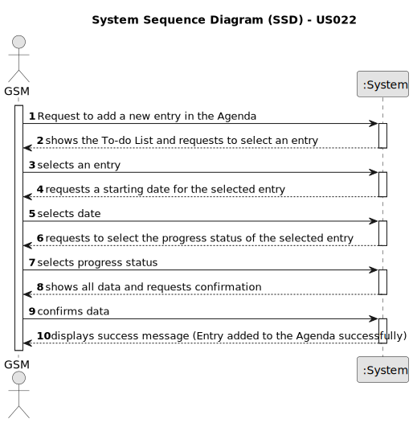

# US022 - Add a new entry in the Agenda

## 1. Requirements Engineering

### 1.1. User Story Description

As a Green Space Manager (GSM), I want to add a new entry in the Agenda.
### 1.2. Customer Specifications and Clarifications 

**From the specifications document:**

> The person who adds the entries in the Agenda is the GSM, and the entry is saved in the system. 
> The new entry must have an associated green space managed by the GSM.
> The new entry must already exist in the To-Do list.
 
**From the client clarifications:**

> **Question:**  When a new entry is added to the Agenda, the progress status of that task will be, by default, set to "planned"?
> 
> **Answer:** Correct.
> 
> **Question:** When the GSM plans a task (that was previously in To-Do) into the Agenda, what aditional data/ information does he need to input when planning?
>
> **Answer:** The starting date for the task. Later the GSM will be able to add the Team and vehicles (if required).
> 
> **Question:** We know that an Agenda entry has a target date, but is this target date supposed to be inputted upon transferring a task from the to-do list to the agenda, or is it supposed to be inputted upon creating the task in the to-do list?
>
> **Answer:** To-do list entries doesn't have dates!
> 
> **Question:** Can I add an entry that has a time period that already has an existing entry in the Agenda?
>
> **Answer:** Yes, because there are many parks to manage and different tasks can be executed at same time in the same park.
> 
> **Question:** When we are registering an entry to the agenda, are the three inputs (selecting an existing task from the to-do list, starting date, and finishing date) sufficient?
>
> **Answer:** The starting date will be enough because the task already has the predicted duration.
> 
> **Question:** When a To-Do List entry is planned and moves to the Agenda, the status change from "Pending" to "Planned". Should this entry be removed from the To-Do List or just change status to "Planned" as it is on the Agenda?
>
> **Answer:** Changing the status in the To-Do list to Planned seems to be a good approach.
> 
> **Question:** Tasks have a status of Planned, Postponed, Canceled or Done. When do they pass to "Planned" status? When they are added to the agenda (before the GSM assigns a team) or when a team is assigned to them?
> 
> **Answer:** Assuming you are using states, a task would become "Planned" as soon as it enters the Agenda.
> 
> **Question:** Should the team be generated like in the us05 or should each element be selected manually?
>
> **Answer:** There is only one US that allows to create teams, as you mentioned, the US05.

### 1.3. Acceptance Criteria

* **AC1:** The new entry must be associated with a green space managed by the GSM.
* **AC2:** The new entry must exist in the To-Do list.
* **AC3:** The system should validate that all required attributes are filled correctly.

### 1.4. Found out Dependencies

* US021 - Add a New Entry to the To-Do List: The task must exist in the To-Do list before it can be added to the Agenda.

### 1.5 Input and Output Data

**Input Data:**

* Typed data:
    * Starting date of the task
	
* Selected data:
    * Entry in the To-Do List
    * Progress status

**Output Data:**

* (In)Success of the operation

### 1.6. System Sequence Diagram (SSD)

**_Other alternatives might exist._**

#### Alternative One

### 1.7 Other Relevant Remarks

* Implement appropriate permissions and access controls to restrict the ability to add agenda entries to authorized GSM users only.
* Ensure that the list of green spaces is maintained and updated to reflect current management responsibilities.