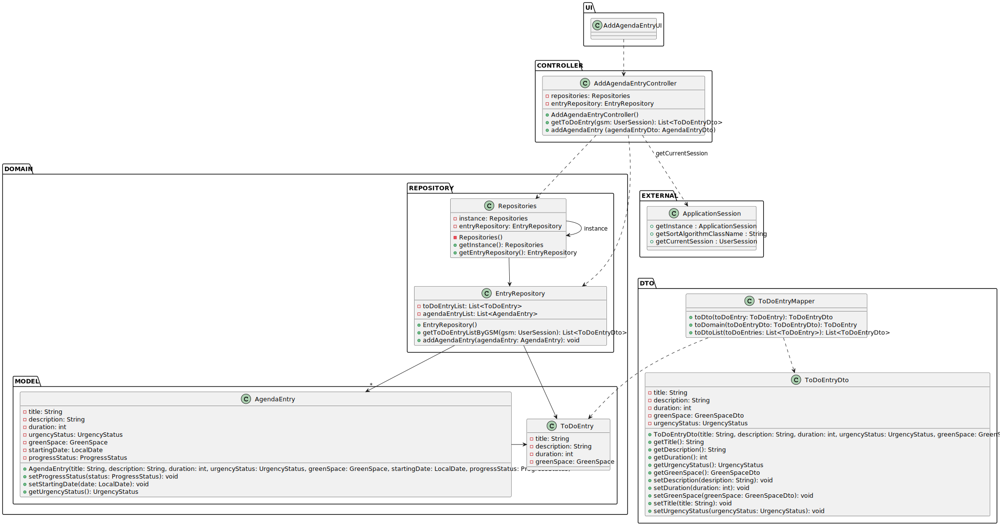

# US022 - Add a new toDoEntry in the Agenda 

## 3. Design - User Story Realization 

### 3.1. Rationale

_**Note that SSD - Alternative One is adopted.**_

| Interaction ID | Question: Which class is responsible for...                  | Answer                   | Justification (with patterns) |
|:---------------|:-------------------------------------------------------------|:-------------------------|:------------------------------|
| Step 1         | ... interacting with the actor?                              | AddAgendaEntryUI         | Pure Fabrication.             |
|                | ... coordinating the US?                                     | AddAgendaEntryController | Controller.                   |
| Step 2         | ... requesting data?                                         | AddAgendaEntryUI         | Pure Fabrication.             |
| Steps 3  and 4 | ... receiving the data?                                      | AddAgendaEntryUI         | Pure Fabrication.             |
|                | ... getting the entry repository?                            | Repositories             | Information Expert.           |
|                | ... getting all the to do entries and return them as a list? | EntryRepository          | Information Expert.           |
|                | ... showing the entries available for selection?             | AddAgendaEntryUI         | Pure Fabrication.             |
|                | ... handling the user selecting an entry?                    | AddAgendaEntryUI         | Pure Fabrication.             |
| Steps  5 and 6 | ... showing the urgency status available for selection?      | AddAgendaEntryUI         | Pure Fabrication.             |
| Step 7         | ... handling the user selecting an urgency stattus?          | AddAgendaEntryUI         | Pure Fabrication.             |
| Step 8         | ... showing the confirmation info?                           | AddAgendaEntryUI         | Pure Fabrication.             |
| Step 9         | ... validating all data (local validation)?                  | Entry                    | Information Expert.           |
|                | ... validating all data (global validation)?                 | EntryRepository          | Information Expert.           |
|                | ... saving the new agenda entry?                             | EntryRepository          | Information Expert.           |
| Step 10        | ... informing of operation success?                          | AddAgendaEntryUI         | Pure Fabrication.             |

### Systematization ##

According to the taken rationale, the conceptual classes promoted to software classes are: 

* Entry
* Agenda

Other software classes (i.e. Pure Fabrication) identified: 

* Repositories
* AddAgendaEntryUI
* EntryRepository
* AddAgendaEntryController

## 3.2. Sequence Diagram (SD)

_**Note that SSD - Alternative Two is adopted.**_

### Full Diagram

This diagram shows the full sequence of interactions between the classes involved in the realization of this user story.

## 3.3. Class Diagram (CD)

