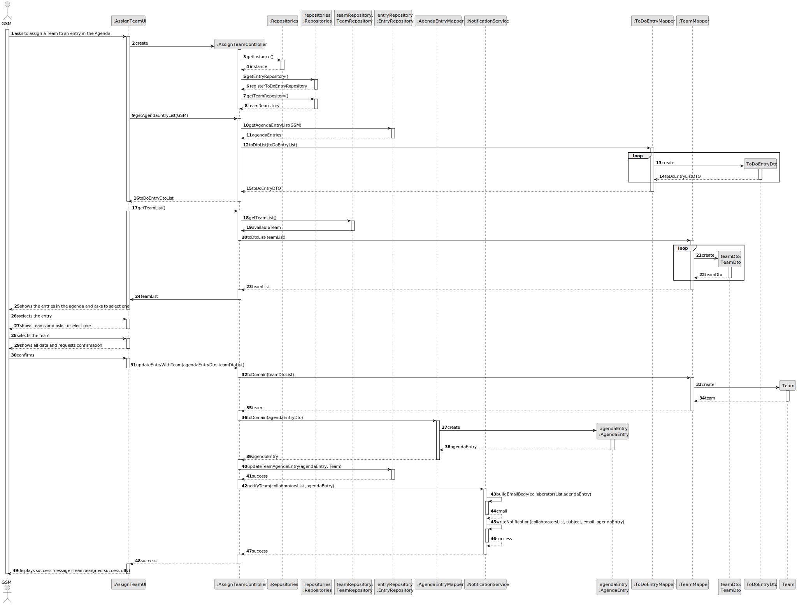

# US006 - Register a Vehicle 

## 3. Design - User Story Realization 

### 3.1. Rationale

_**Note that SSD - Alternative One is adopted.**_

| Interaction ID | Question: Which class is responsible for...  | Answer                    | Justification (with patterns)                                                                                                                                                                 |
|:---------------|:---------------------------------------------|:--------------------------|:----------------------------------------------------------------------------------------------------------------------------------------------------------------------------------------------|
| Step 1         | ... interacting with the actor?              | RegisterVehicleUI         | Pure Fabrication: There is no need to assign this responsibility to any existing class in the Domain Model. The UI class is a utility class for handling user interaction.                    |
|                | ... coordinating the US?                     | RegisterVehicleController | Controller: RegisterVehicleController is responsible for coordinating and controlling the flow of interaction, applying the Controller pattern.                                               |
| Step 2         | ... display vehicle data input fields?       | RegisterVehicleUI         | Pure Fabrication: RegisterVehicleUI displays the input fields for vehicle data, promoting low coupling by separating UI logic from domain logic.                                              |
| Step 3         | ... types vehicle data?                      | RegisterVehicleUI         | Pure Fabrication: RegisterVehicleUI displays the input fields for vehicle data, promoting low coupling by separating UI logic from domain logic.                                              |
| Step 4         | ... confirms the user's input data?          | RegisterVehicleUI         | Pure Fabrication: RegisterVehicleUI confirms the user's input data before proceeding with the registration process, ensuring data integrity and adhering to the Creator pattern.              |
| Step 5         | ... handles the registration of the vehicle? | RegisterVehicleController | Controller: RegisterVehicleController manages the registration process, ensuring high cohesion and low coupling by encapsulating related functionality.                                       |
|                | ... get VehicleRepository?                   | Repositories              | Pure Fabrication:  Repositories is responsible for providing access to various repositories. It promotes low coupling and high cohesion by encapsulating data access logic.                   |
|                | ... verify existing vehicle?                 | VehicleRepository         | Information Expert: VehicleRepository performs global validation, adhering to the Protected Variation pattern by encapsulating data access.                                                   |
|                | ... register a vehicle?                      | VehicleRepository         | Creator: Vehicle is directly created by vehicleRepository, which encapsulates the logic for managing vehicles.                                                                                |
|                | ... validating all data (local validation)?  | Vehicle                   | Information Expert: Vehicle performs local validation on its attributes, adhering to the Information Expert pattern by encapsulating its own data validation logic.                           | 
|                | ... validating all data (global validation)? | VehicleRepository         | Information Expert: VehicleRepository performs global validation, following the Protected Variation pattern by encapsulating validation rules.                                                | 
|                | ... stores vehicle registration data?        | VehicleRepository         | Repository Pattern: VehicleRepository is responsible for persisting and managing vehicle registration data, applying the Low Coupling pattern by decoupling data storage from business logic. |
| Step 6         | ... informing operation success?             | RegisterVehicleUI         | Pure Fabrication: RegisterVehicleUI handles user interaction and displays success/error messages, promoting low coupling and high cohesion by encapsulating UI logic.                         | 

### Systematization ##

According to the taken rationale, the conceptual classes promoted to software classes are: 

* Vehicle

Other software classes (i.e. Pure Fabrication) identified: 

* Repositories
* RegisterVehicleUI
* VehicleRepository
* RegisterVehicleController

## 3.2. Sequence Diagram (SD)

_**Note that SSD - Alternative Two is adopted.**_

### Full Diagram

This diagram shows the full sequence of interactions between the classes involved in the realization of this user story.

## 3.3. Class Diagram (CD)

