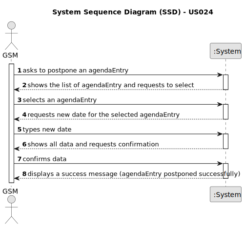

# US024 - Postpone an entry in the Agenda to a future date

## 1. Requirements Engineering

### 1.1. User Story Description

> As a Green Space Manager (GSM), I want to Postpone an entry in the Agenda to a specific future date.

### 1.2. Customer Specifications and Clarifications 

**From the specifications document:**

> The Agenda is made up of entries that relate to a task (which was previously in the To-Do List), the team that will 
> carry out the task, the vehicles/equipment assigned to the task, expected duration, and the status (Planned, Postponed, Canceled, Done).

**From the client clarifications:**

> **Question:** The selected task(s) will be postponed by one interval defined by the user or for the next day?
> 
> **Answer:** When postponing a task, the new predicated date for execution should be inserted.

> **Question:** 
> 
> **Answer:** 

> **Question:** 
> 
> **Answer:** 

> **Question:** 
> 
> **Answer:**

> **Question:** 
> 
> **Answer:** 
 
> **Question:** 
> 
> **Answer:** 

### 1.3. Acceptance Criteria

* **AC1:** The entry must exist in the Agenda
* **AC2:** The new date must be in the future and a valid calendar date.
* **AC3:** The postponement action should update the entry’s status to “Postponed”.
* **AC4:** The system should notify the team assigned to the task about the postponement.
* **AC5:** The postponement should not conflict with any existing planned tasks for the same team or equipment.

### 1.4. Found out Dependencies

* US22: Adding a new entry in the Agenda
* US23: Assigning a team to an entry in the Agenda.

### 1.5 Input and Output Data

**Input Data:**

* Typed data:
    * New specific future date for the task
	
* Selected data:
    * Task on the Agenda.

**Output Data:**

* (In)Success of the operation
* Notification message to the team.

### 1.6. System Sequence Diagram (SSD)

**_Other alternatives might exist._**

#### Alternative One

### 1.7 Other Relevant Remarks

* Implement appropriate permissions and access controls to restrict the ability to Postpone an entry to authorized GSM users only.