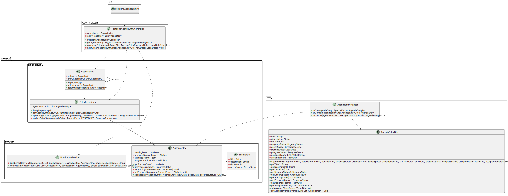

# US024 - Postpone an entry in the Agenda to a future date

## 3. Design - User Story Realization 

### 3.1. Rationale

_**Note that SSD - Alternative One is adopted.**_

| Interaction ID | Question: Which class is responsible for... | Answer                       | Justification (with patterns)                                                                                                                                              |
|:---------------|:--------------------------------------------|:-----------------------------|:---------------------------------------------------------------------------------------------------------------------------------------------------------------------------|
| Step 1         | ... interacting with the actor?             | PostponeAgendaTaskUI         | Pure Fabrication: There is no need to assign this responsibility to any existing class in the Domain Model. The UI class is a utility class for handling user interaction. |
|                | ... coordinating the US?                    | PostponeAgendaTaskController | Controller: PostponeAgendaTaskController is responsible for coordinating and controlling the flow of interaction, applying the Controller pattern.                         |
|                | ... getting task repository?                | Repositories                 | Pure Fabrication: Repositories is responsible for providing access to various repositories. It promotes low coupling and high cohesion by encapsulating data access logic. |
| Step 2         | ... show the task list?                     | PostponeAgendaTaskUI         | Pure Fabrication: PostponeAgendaTaskUI displays the task list, promoting low coupling by separating UI logic from domain logic.                                            |
| Step 3         | ... selecting a task?                       | PostponeAgendaTaskUI         | Pure Fabrication: PostponeAgendaTaskUI handles the user selection of tasks, maintaining low coupling and high cohesion by managing UI interactions.                        |
| Step 4         | ... requesting new date for the task?       | PostponeAgendaTaskUI         | Pure Fabrication: PostponeAgendaTaskUI requests the new date from the user, ensuring separation of concerns between UI and business logic.                                 |
| Step 5         | ... submitting the new date?                | PostponeAgendaTaskController | Controller: PostponeAgendaTaskController handles the submission of the new date, coordinating the process and applying the Controller pattern.                             |
| Step 6         | ... displaying task data?                   | PostponeAgendaTaskUI         | Pure Fabrication: PostponeAgendaTaskUI shows the data user insert.                                                                                                         |
| Step 7         | ... confirms data                           | PostponeAgendaTaskUI         | Pure Fabrication: PostponeAgendaTaskUI confirms the data from the user.                                                                                                    |
|                | ... postponing the task?                    | Agenda                       | Information Expert: Vehicle performs local validation on its attributes, adhering to the Information Expert pattern by encapsulating its own data validation logic.        | 
|                | ... notifying the team?                     | TeamRepository               | Information Expert: TeamRepository handles team notifications as it manages team data and relationships.                                                                   | 
|                | ... sending notifications?                  | NotificationService          | Pure Fabrication: NotificationService is responsible for sending notifications, ensuring the separation of communication concerns from business logic.                     |
| Step 8         | ... informing operation success?            | PostponeAgendaTaskUI         | Pure Fabrication: PostponeAgendaTaskUI handles user interaction and displays success/error messages, promoting low coupling and high cohesion by encapsulating UI logic.   | 

### Systematization ##

According to the taken rationale, the conceptual classes promoted to software classes are: 

* Task
* Agenda

Other software classes (i.e. Pure Fabrication) identified: 

* Repositories
* PostponeAgendaTaskUI
* PostponeAgendaTaskController
* TaskRepository
* TeamRepository
* NotificationService

## 3.2. Sequence Diagram (SD)

_**Note that SSD - Alternative Two is adopted.**_

### Full Diagram

This diagram shows the full sequence of interactions between the classes involved in the realization of this user story.

### Split Diagrams

The following diagram shows the same sequence of interactions between the classes involved in the realization of this user story, but it is split in partial diagrams to better illustrate the interactions between the classes.

It uses Interaction Occurrence (a.k.a. Interaction Use).

**Get Task List Partial SD**

**Postpone a Task in Agenda Partial SD**

**Notify Team**

## 3.3. Class Diagram (CD)

