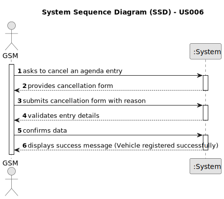

# US025 - Cancel an entry in the Agenda

## 1. Requirements Engineering

### 1.1. User Story Description

As a Green Space Manager (GSM), I want to cancel an entry in the Agenda.

### 1.2. Customer Specifications and Clarifications 

**From the specifications document:**

> The person who cancels the entries in the Agenda is the GSM, and the entry progressStatus is updated in the system.
> A canceled task should not be deleted but rather change its state.

**From the client clarifications:**

> **Question:** When a task is cancelled, is it possible to put it back on the agenda again later?
> 
> **Answer:** Yes.

> **Question:** When we cancel a task, do we move it again to the To-Do List?
>
> **Answer:** No.

> **Question:** As far as I understand, when a GSM wants to cancel a task or a Collaborator wants to record the completion of a task, the task just changes its progressStatus in the Agenda to "Canceled" or "Done", respectively. Correct?
>
> **Answer:** Yes

> **Question:** Does the task associated with the Agenda toDoEntry in which this happens remain in the To-do List or can it be removed, unlike what happens in the Agenda? Or even, would this process be different between a completed task and a canceled task?
>
> **Answer:** I suppose when a task goes to the Agenda, it leaves the To-Do list but maybe a different flow could be considered.

> **Question:** When the GSM wants to cancel a task, this task can only be canceled if its status is PLANNED or POSTPONED, correct?
>
> **Answer:** No, just planned because if there is a Postponed entry then there is also a Planned Entry with the new date.

### 1.3. Acceptance Criteria

* **AC1:** The entry must exist in the Agenda
* **AC1:** A canceled task should not be deleted but rather change its state to "canceled."
* **AC2:** The system should notify all team members assigned to the task about the cancellation.

### 1.4. Found out Dependencies

* US022 - Add a new entry in the Agenda: An entry must exist in the agenda first in order to be cancelled.
* US023 - Assign a Team to an Entry in the Agenda: Team members need to be notified upon task cancellation.

### 1.5 Input and Output Data

**Input Data:**

* Typed data:
    * None
	
* Selected data:
    * Task on the Agenda

**Output Data:**

* (In)Success of the operation
* Notifications sent to team members.

### 1.6. System Sequence Diagram (SSD)

**_Other alternatives might exist._**

#### Alternative One

### 1.7 Other Relevant Remarks

* Implement appropriate permissions and access controls to restrict the ability to cancel agenda entries to authorized GSM users only.