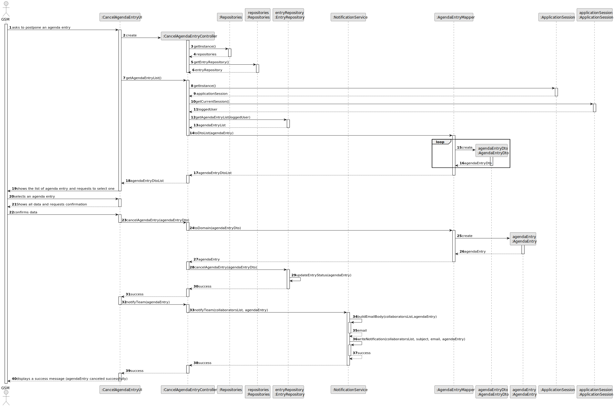
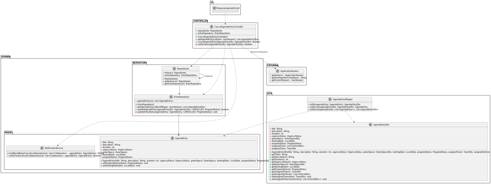

# US025 - Cancel an entry in the agenda 

## 3. Design - User Story Realization 

### 3.1. Rationale

_**Note that SSD - Alternative One is adopted.**_

| Interaction ID | Question: Which class is responsible for...                   | Answer                      | Justification (with patterns) |
|:---------------|:--------------------------------------------------------------|:----------------------------|:------------------------------|
| Step 1         | ... interacting with the actor?                               | CancelAgendaEntryUI         | Pure Fabrication.             |
|                | ... coordinating the US?                                      | CancelAgendaEntryController | Controller.                   |
| Step 2         | ... requesting the data?                                      | CancelAgendaEntryUI         | Pure Fabrication.             |
| Step 3         | ... receiving the data?                                       | CancelAgendaEntryUI         | Pure Fabrication.             |
|                | ... getting entry repository?                                 | Repositories                | Information Expert.           |
|                | ... getting all the agenda entries and return them as a list? | EntryRepository             | Information Expert.           |
|                | ... showing the entries available for selection?              | CancelAgendaEntryUI         | Pure Fabrication.             |
| Step 4         | ... handling the user selecting an entry?                     | CancelAgendaEntryUI         | Pure Fabrication.             |
| Step 5         | ... showing the confirmation info?                            | CancelAgendaEntryUI         | Pure Fabrication.             |
|                | ... validating all data (local validation)?                   | Entry                       | Information Expert.           |
|                | ... validating all data (global validation)?                  | EntryRepository             | Information Expert.           | 
|                | ... saving the new status of the agenda entry?                | EntryRepository             | Information Expert            |
|                | ... notifying the team?                                       | TeamRepository              | Information Expert.           | 
|                | ... sending notifications?                                    | NotificationService         | Pure Fabrication.             |
| Step 6         | ... informing of operation success?                           | CancelAgendaEntryUI         | Pure Fabrication.             | 

### Systematization ##

According to the taken rationale, the conceptual classes promoted to software classes are: 

* Entry
* Agenda

Other software classes (i.e. Pure Fabrication) identified: 

* Repositories
* CancelAgendaEntryUI
* CancelAgendaEntryController
* EntryRepository
* TeamRepository
* NotificationService

## 3.2. Sequence Diagram (SD)

_**Note that SSD - Alternative Two is adopted.**_

### Full Diagram

This diagram shows the full sequence of interactions between the classes involved in the realization of this user story.

## 3.3. Class Diagram (CD)

