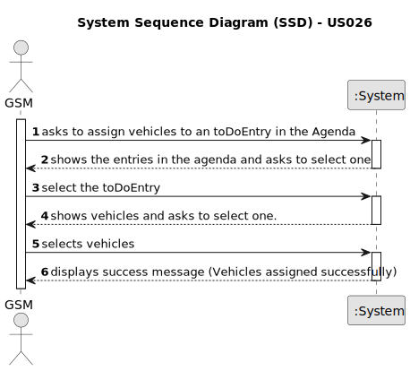

# US026 - Assign one or more vehicles to an agendaEntry in the Agenda

## 1. Requirements Engineering

### 1.1. User Story Description

As a GSM, I want to assign one or more vehicles to an agendaEntry in
the Agenda.

### 1.2. Customer Specifications and Clarifications 

**From the specifications document:**

>  

**From the client clarifications:**

> **Question:** What is the criteria to accept an assign of a Vehicle to an Entry? 
Only Vehicle with no Entry's can be assigned ?
Only Vehicles with no Entry on the day selected ?
It is possible to add any kind of vehicles?
>
> **Answer:** The vehicle needs to be available in the period.
Yes, any can of vehicles can be assigned.

> **Question:** Todos os veículos da empresa devem estar disponíveis para os atribuir a uma entrada da agenda, ou só os veículos com a manutenção em dia?
>
> **Answer:** Todos os veiculos que não estejam assignados a uma tarefa no mesmo periodo.
Num contexto real precisariamos de gerir também (in)disponibilidade dos veiculos por revisões ou avarias mas não é necessário nesta prova-de-conceito.

> **Question:** How will the Green Spaces Manager choose the vehicle to assign? By its plate?
>
> **Answer:** Assuming you mean assingning to a Task/Agenda Entry, the data related with vehicle should be provided in order to ease the selection.

> **Question:** Is the number of vehicles to be assigned provided by the Green Spaces Manager?
>
> **Answer:** There is no specification concerning the number of vehicles, is upt to GSM decide what vehicles the task needs.

> **Question:**
>
> **Answer:**

> **Question:**
>
> **Answer:**

### 1.3. Acceptance Criteria

* **AC1:** The vehicle needs to be available in the period.

### 1.4. Found out Dependencies

* None.

### 1.5 Input and Output Data

**Input Data:**

* Typed data:
    * none
	
* Selected data:
    * agendaEntry
    * Vehicle

**Output Data:**

* (In)Success of the operation

### 1.6. System Sequence Diagram (SSD)

**_Other alternatives might exist._**

#### Alternative One

### 1.7 Other Relevant Remarks

* 