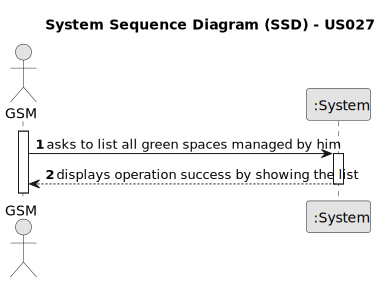

# US027 - List all green spaces managed by a GSM.

## 1. Requirements Engineering

### 1.1. User Story Description

As a GSM, I need to list all green spaces managed by me.

### 1.2. Customer Specifications and Clarifications 

**From the specifications document:**

>  The list must be organized by size in descending order. There should be at least two algorithms for organizing the list.
 
**From the client clarifications:**

> **Question:** What's in the configuration file mentioned in AC1?
> 
> **Answer:** That file will indicate the possible sorting methods that the application works with. Through a method given in ESOFT (protected variations), an interface with several methods will be imported.

### 1.3. Acceptance Criteria

* **AC1:** The list of green spaces must be sorted by size in descending order. The sorting algorithm to be used by the application must be defined through a configuration file. At least two sorting algorithms should be available.
* **AC2:** If there are no parks registered to form the list, the program should warn the user.

### 1.4. Found out Dependencies

* There is a dependency, which is the US20 - Register a green space.

### 1.5 Input and Output Data

**Input Data:**

* Typed data:
    * None
	
* Selected data:
    * Sorting algorithm (descending by size (default)) - on the config file

**Output Data:**

* The generated list ((In)Success of the operation)

### 1.6. System Sequence Diagram (SSD)

**_Other alternatives might exist._**

#### Alternative One

### 1.7 Other Relevant Remarks

* none