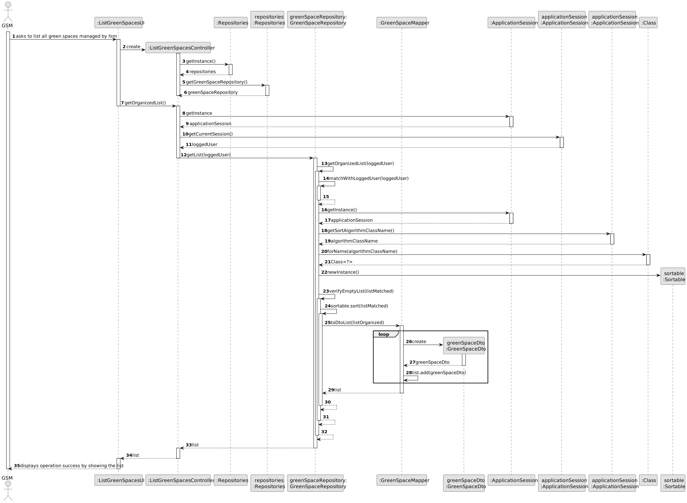

# US027 - List all green spaces managed by a GSM.

## 3. Design - User Story Realization 

### 3.1. Rationale

_**Note that SSD - Alternative One is adopted.**_

| Interaction ID | Question: Which class is responsible for...   | Answer                    | Justification (with patterns)                                                           |
|:---------------|:----------------------------------------------|:--------------------------|:----------------------------------------------------------------------------------------|
| Step 1         | ... interacting with the actor?               | ListGreenSpacesUI         | Pure Fabrication: There is no need to assign this responsibility to any existing class. |
|                | ... coordinating the US?                      | ListGreenSpacesController | Controller.                                                                             |
| Step 2         | ... request the sorting algorithm?            | RegisterVehicleUI         | Pure Fabrication.                                                                       |
| Step 3         | ... get the Green Space Repository?           | Repositories              | Information Expert, High cohesion, Low coupling.                                        |
|                | ... creating the Green Spaces List?           | GreenSpaceRepository      | Information Expert.                                                                     |
|                | ... verifying if the generated list is empty? | GreenSpaceRepository      | Information Expert.                                                                     |
|                | ... having the list to organize?              | GreenSpaceRepository      | Information Expert.                                                                     |
|                | ... organizing the list of green spaces?      | Sortable                  | Protected Variations.                                                                   |
| Step 4         | ... showing the created list?                 | RegisterVehicleUI         | Pure Fabrication.                                                                       |
### Systematization ##

According to the taken rationale, the conceptual classes promoted to software classes are: 

* GreenSpace

Other software classes (i.e. Pure Fabrication) identified: 

* Repositories
* ListGreenSpacesUI
* ListGreenSpacesController
* GreenSpaceRepository
* SortAlgorithms

## 3.2. Sequence Diagram (SD)

_**Note that SSD - Alternative Two is adopted.**_

### Full Diagram

This diagram shows the full sequence of interactions between the classes involved in the realization of this user story.

## 3.3. Class Diagram (CD)

