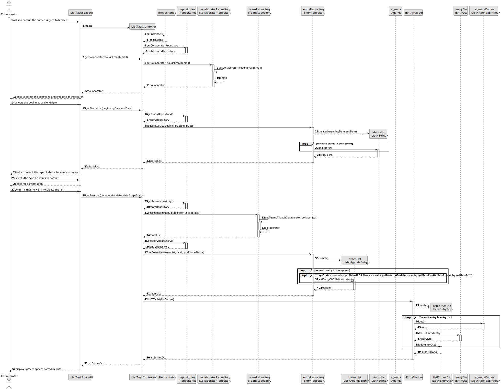
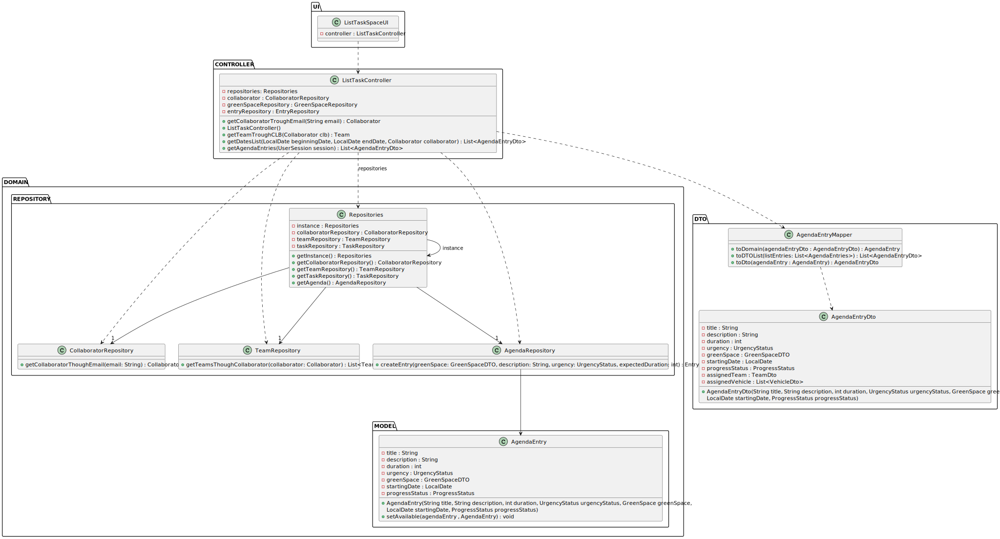

# US028 - List the entrys assigned to myself

## 3. Design - User Story Realization 

### 3.1. Rationale

_**Note that SSD - Alternative One is adopted.**_

| Interaction ID | Question: Which class is responsible for...         | Answer             | Justification (with patterns) |
|:---------------|:----------------------------------------------------|:-------------------|:------------------------------|
| Step 1         | ... interacting with the actor?                     | ListTaskSpaceUI    | Pure Fabrication              |
|                | ... coordinating the US?                            | ListTaskController | Controller                    |
| Step 2         | ... display date selection fields?                  | ListTaskSpaceUI    | Pure Fabrication              |
| Step 3         | ... selects the beginning and end date?             | ListTaskSpaceUI    | Pure Fabrication              |
| Step 4         | ... selects the type of status he wants to consult? | ListTaskSpaceUI    | Pure Fabrication              |
| Step 5         | ... asks for confirmation?                          | ListTaskSpaceUI    | Pure Fabrication              |
| Step 6         | ... confirms that he wants to create the list?      | ListTaskSpaceUI    | Pure Fabrication              |
| Step 7         | ... handles the creation of the task list?          | ListTaskController | Controller                    |
|                | ... get EntryRepository?                            | Repositories       | Pure Fabrication              |
|                | ... verify existing entries?                        | EntryRepository    | Information Expert            |
|                | ... create a task list?                             | EntryRepository    | Creator                       |
|                | ... validating all data (local validation)?         | Entry              | Information Expert            |
|                | ... validating all data (global validation)?        | EntryRepository    | Information Expert            |
|                | ... stores task list data?                          | EntryRepository    | Repository Pattern            |
| Step 8         | ... informing operation success?                    | ListTaskSpaceUI    | Pure Fabrication              |

### Systematization ##

According to the taken rationale, the conceptual classes promoted to software classes are:

* Entry

Other software classes (i.e. Pure Fabrication) identified:

* ListTaskSpaceUI
* ListTaskController
* Repositories
* EntryRepository

## 3.2. Sequence Diagram (SD)

_**Note that SSD - Alternative Two is adopted.**_

### Full Diagram

This diagram shows the full sequence of interactions between the classes involved in the realization of this user story.

## 3.3. Class Diagram (CD)

