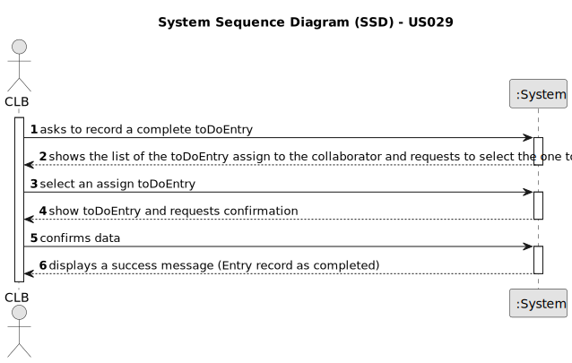

# US029 - Record the completion of a task

## 1. Requirements Engineering

### 1.1. User Story Description

As a Collaborator, I want to record the completion of a task.

### 1.2. Customer Specifications and Clarifications 

**From the specifications document:**

>  To record the completion of a task, it is necessary to ensure that the task exists in both the Agenda and the To-Do List. 
> The task should be marked as completed in both lists once the completion is recorded.

**From the client clarifications:**

> **Question:** The collaborator can see what type of toDoEntry's? Like what progressStatus can he filter? Can he see canceled Entry's?
>
> **Answer:** The ones assigned to him. He can filter by the different values the progressStatus of the progressStatus, like planned, executed, canceled ...

> **Question:** When a collaborator records a task, it should be asked for any observations regarding the completed task?
>
> **Answer:** Maybe if optional, not mandatory.

> **Question:** The collaborator should be able to change the progressStatus of any task or only tasks assigned to him?
>
> **Answer:** Yes.

> **Question:** Does the task associated with the Agenda toDoEntry in which this happens remain in the To-do List or can it be removed, unlike what happens in the Agenda? Or even, would this process be different between a completed task and a canceled task?
>
> **Answer:** I suppose when a task goes to the Agenda, it leaves the To-Do list but maybe a different flow could be considered. 

> **Question:** Can an employee record more than one completed task at a time?
> 
> **Answer:** It's a matter of UX/UI, each dev team can decide about it.

> **Question:** As far as I understand, when a GSM wants to cancel a task or a Collaborator wants to record the completion of a task, the task just changes its progressStatus in the Agenda to "Canceled" or "Done", respectively
> 
> **Answer:** Yes.
### 1.3. Acceptance Criteria

* **AC1** The task must exist in both the Agenda and the To-Do List before recording completion.

### 1.4. Found out Dependencies

* User Story US021 - Add a new toDoEntry to the To-Do List.

* User Story US022 - Add a new toDoEntry in the Agenda.

### 1.5 Input and Output Data

**Input Data:**

* Typed data:
    * None.
	
* Selected data:
    * Assign toDoEntry

**Output Data:**

* (In)Success of the operation

### 1.6. System Sequence Diagram (SSD)

**_Other alternatives might exist._**

#### Alternative One

### 1.7 Other Relevant Remarks

* Implement appropriate permissions and access controls to restrict the ability to record the completion of a task to an authorized Collaborator user.