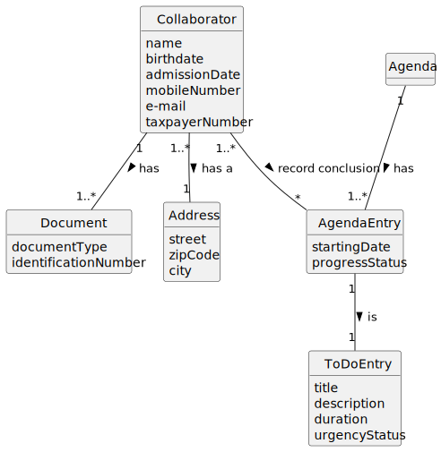

# US029 - Record the completion of a task

## 2. Analysis

### 2.1. Relevant Domain Model Excerpt 

### 2.2. Other Remarks

- All dates used (birthDate and admissionDate) are in day/month/year format.
- The mobile number should have nine numbers.
- The e-mail should have one arroba ("@") and one dot (".").
- The taxpayer number should have 9 numbers.
- 