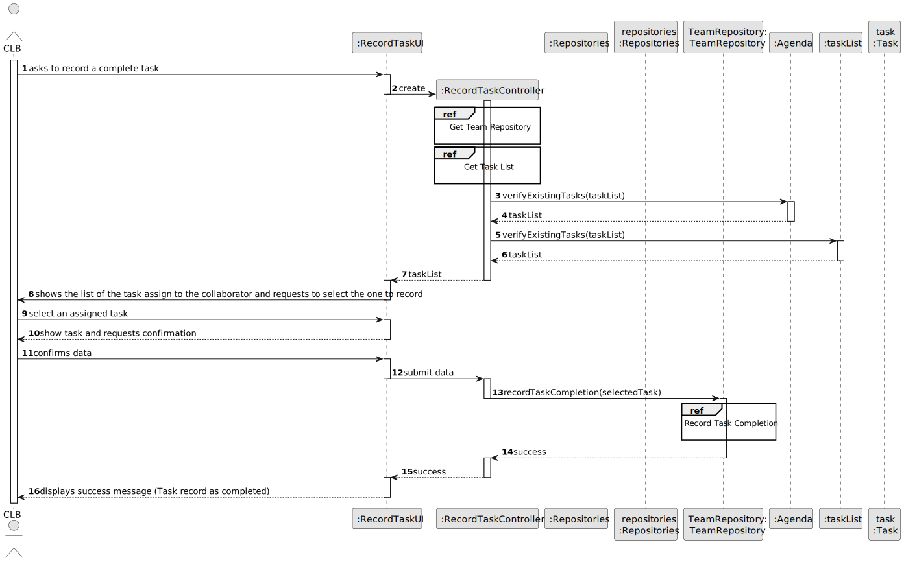
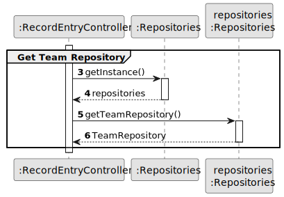
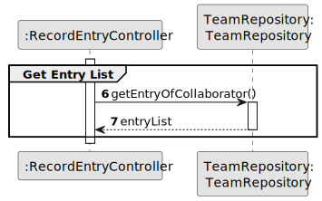
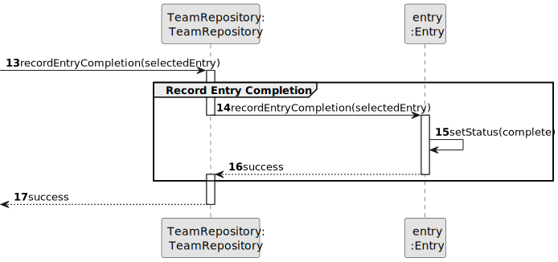

# US029 - Record the completion of a task

## 3. Design - User Story Realization 

### 3.1. Rationale

_**Note that SSD - Alternative One is adopted.**_

| Interaction ID | Question: Which class is responsible for...  | Answer                | Justification (with patterns)                                                                                                                                               |
|:---------------|:---------------------------------------------|:----------------------|:----------------------------------------------------------------------------------------------------------------------------------------------------------------------------|
| Step 1         | ... interacting with the actor?              | RecordEntryUI         | Pure Fabrication: There is no need to assign this responsibility to any existing class in the Domain Model. The UI class is a utility class for handling user interaction.  |
|                | ... coordinating the US?                     | RecordEntryController | Controller: RecordEntryController orchestrates the interaction flow, managing the communication between the UI and other components, following the Controller pattern.      |
| Step 2         | ... display task list?                       | RecordEntryUI         | Pure Fabrication: RecordEntryUI displays the task list for the collaborator, ensuring separation of UI logic from domain logic and promoting low coupling.                  |
| Step 3         | ... select an assigned task?                 | RecordEntryUI         | Pure Fabrication: RecordEntryUI handles user interaction to select a task, ensuring separation of concerns and promoting low coupling.                                      |
| Step 4         | ... confirms the selected task?              | RecordEntryUI         | Pure Fabrication: RecordEntryUI confirms the selected task before proceeding, ensuring data integrity and adhering to the Creator pattern.                                  |
| Step 5         | ... handles recording task completion?       | RecordEntryController | Controller: RecordEntryController manages the process of recording task completion, ensuring high cohesion and low coupling by encapsulating related functionality.         |
|                | ... get TeamRepository?                      | Repositories          | Pure Fabrication:  Repositories is responsible for providing access to various repositories. It promotes low coupling and high cohesion by encapsulating data access logic. |
|                | ... retrieve tasks assigned to collaborator? | TeamRepository        | Information Expert: TeamRepository performs global validation, adhering to the Protected Variation pattern by encapsulating data access.                                    |
|                | ... verify existing tasks?                   | Agenda                | Pure Fabrication: Agenda verifies the existence of entries, ensuring data integrity and adhering to the Creator pattern.                                                    |
|                | ... register task completion?                | TeamRepository        | Creator: TeamRepository directly manages the process of recording task completion, encapsulating the logic for managing tasks.                                              | 
|                | ... update task progressStatus?                      | Entry                 | Information Expert: Task updates its own progressStatus upon completion, adhering to the Information Expert pattern by encapsulating its own state management.                      | 
| Step 6         | ... informing operation success?             | RecordEntryUI         | Pure Fabrication: RecordTaskUI handles user interaction and displays success/error messages, promoting low coupling and high cohesion by encapsulating UI logic.            | 

### Systematization ##

According to the taken rationale, the conceptual classes promoted to software classes are: 

* Entry

Other software classes (i.e. Pure Fabrication) identified: 

* Repositories
* RecordEntryUI
* RecordEntryController
* TeamRepository

## 3.2. Sequence Diagram (SD)

_**Note that SSD - Alternative Two is adopted.**_

### Full Diagram

This diagram shows the full sequence of interactions between the classes involved in the realization of this user story.

### Split Diagrams

The following diagram shows the same sequence of interactions between the classes involved in the realization of this user story, but it is split in partial diagrams to better illustrate the interactions between the classes.

It uses Interaction Occurrence (a.k.a. Interaction Use).

**Get Team Repository Partial SD**

**Get Entry List SD**

**Record Entry Completion**

## 3.3. Class Diagram (CD)

