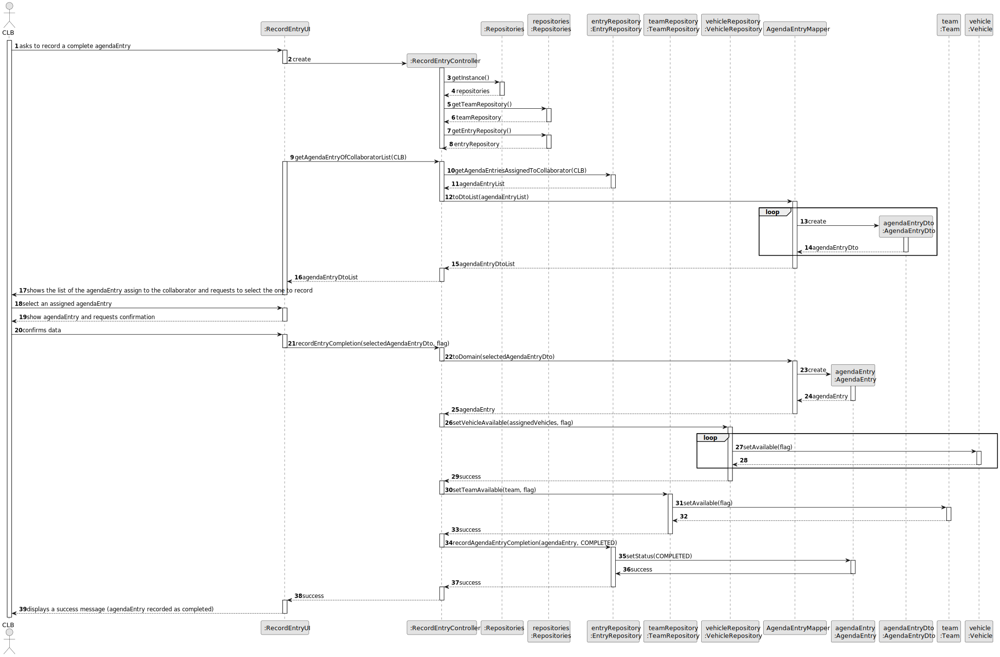
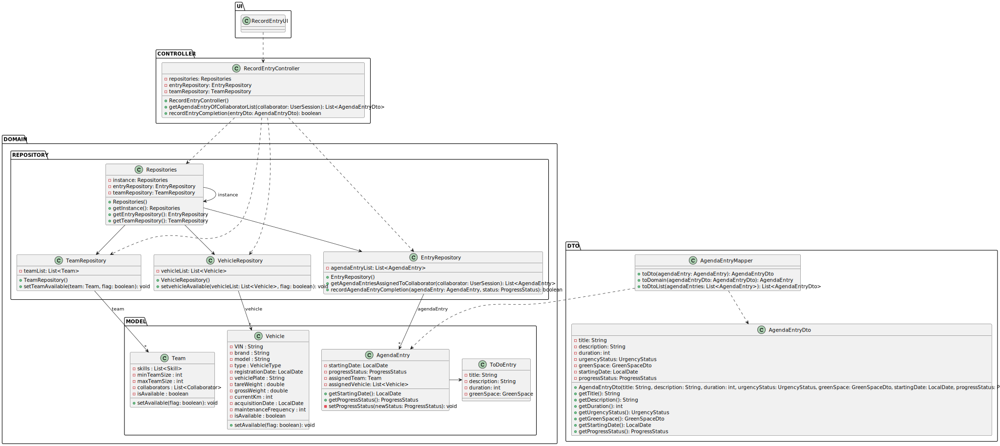

# US029 - Record the completion of a task

## 3. Design - User Story Realization 

### 3.1. Rationale

_**Note that SSD - Alternative One is adopted.**_

| Interaction ID | Question: Which class is responsible for...                      | Answer                | Justification (with patterns)                               |
|:---------------|:-----------------------------------------------------------------|:----------------------|:------------------------------------------------------------|
| Step 1         | ... interacting with the actor?                                  | RecordEntryUI         | Pure Fabrication                                            |
|                | ... coordinating the US?                                         | RecordEntryController | Controller                                                  |
|                | ... get EntryRepository?                                         | Repositories          | Pure Fabrication, low coupling and high cohesion            |
|                | ... get agendaEntry list?                                        | EntryRepository       | Information Expert, low coupling and high cohesion          |
|                | ... get TeamRepository?                                          | Repositories          | Information Expert, low coupling and high cohesion          |
|                | ... transforms agendaEntryList to agendaEntryDtoList?            | AgendaEntryMapper     | Information Expert, creator, low coupling and high cohesion |
|                | ... retrieve agendaEntries assigned to collaborator?             | EntryRepository       | Information Expert, low coupling and high cohesion          |
| Step 2         | ... display agendaEntry list?                                    | RecordEntryUI         | Pure Fabrication                                            |
| Step 3         | ... select an assigned agendaEntry?                              | RecordEntryUI         | Pure Fabrication                                            |
| Step 4         | ... show selected assigned agendaEntry and request confirmation? | RecordEntryUI         | Pure Fabrication                                            |
| Step 5         | ... confirms the selected agendaEntry?                           | RecordEntryUI         | Pure Fabrication                                            |
|                | ... handles recording agendaEntry completion?                    | RecordEntryController | Controller                                                  |
|                | ... transforms agendaEntryDto to agendaEntry?                    | AgendaEntryMapper     | Information Expert, creator, low coupling and high cohesion |
|                | ... update agendaEntry progressStatus?                           | AgendaEntry           | Information Expert                                          |
|                | ... update Team to available?                                    | Team                  | Information Expert                                          |
|                | ... update Vehicle to available?                                 | Vehicle               | Information Expert                                          |
| Step 6         | ... informing operation success?                                 | RecordEntryUI         | Pure Fabrication                                            | 

### Systematization ##

According to the taken rationale, the conceptual classes promoted to software classes are: 

* Vehicle
* Team
* AgendaEntry
* AgendaEntryDto

Other software classes (i.e. Pure Fabrication) identified: 

* Repositories
* RecordEntryUI
* RecordEntryController
* TeamRepository
* VehicleRepository
* EntryRepository
* AgendaEntryMapper

## 3.2. Sequence Diagram (SD)

_**Note that SSD - Alternative Two is adopted.**_

### Full Diagram

This diagram shows the full sequence of interactions between the classes involved in the realization of this user story.

## 3.3. Class Diagram (CD)

